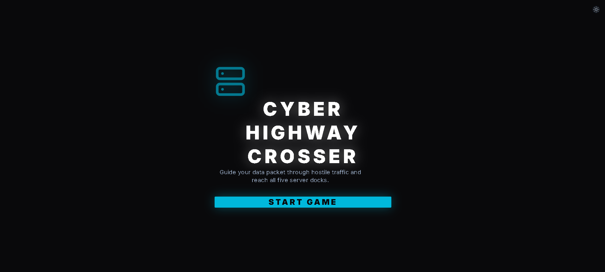
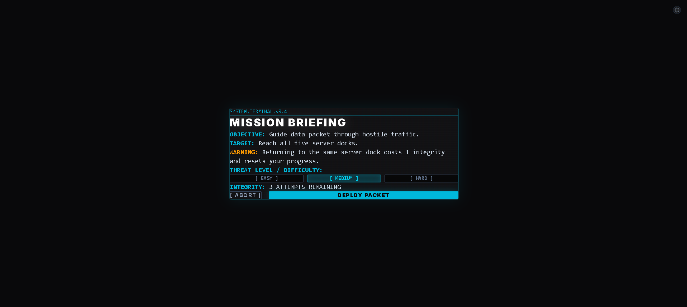
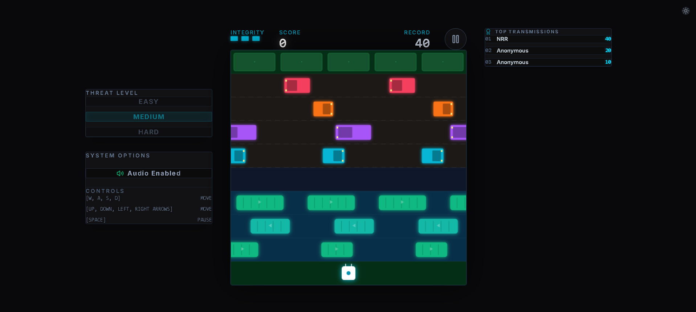

# 🛣️ Cyber Highway Crosser

> A cyberpunk arcade game inspired by the classic Frogger formula. Navigate through neon traffic and digital river platforms to reach five secure server docks.


---

## ✨ Features

- 🎮 Cyberpunk Frogger-style arcade gameplay
- ⚡ Easy, Medium, and Hard difficulty modes
- 🚗 Dynamic traffic and moving river platforms
- 🖥️ Five server docks and endless gameplay cycles
- ❤️ Three lives with collision protection
- 🎵 Synthesized chiptune music and sound effects using Web Audio API
- 🔇 Audio mute/unmute control
- 🌙 Dark/light theme support
- ⌨️ Keyboard controls with Arrow Keys and WASD
- 📱 Touch controls for mobile and tablet
- 🏆 Local top-10 leaderboard for each difficulty
- 💾 Local high scores and game statistics using `localStorage`

---

## 📸 Screenshots

### Main Menu



### Mission Briefing



### Gameplay



---

## 🕹️ Controls

| Action | Keys |
|---|---|
| Move Up | `↑` / `W` |
| Move Down | `↓` / `S` |
| Move Left | `←` / `A` |
| Move Right | `→` / `D` |
| Pause / Resume | `Space` |
| Start / Play Again | `Space`, `↑`, or `W` |

Mobile and tablet players can use the on-screen D-pad and pause button.

---

## ⚡ Difficulty

| Mode | Gameplay |
|---|---|
| **Easy** | Slower traffic and wider spacing |
| **Medium** | Standard arcade difficulty |
| **Hard** | Faster traffic and tighter spacing |

Difficulty is selected before starting a game and has its own leaderboard and high scores.

---

## 🏆 Scoring

- **+10 points** for reaching a server dock
- **+50 bonus points** for completing all five docks
- **3 lives** per game
- Leaderboards store the top 10 scores locally for each difficulty

---

## 🛠️ Tech Stack

| Technology | Purpose |
|---|---|
| React | UI and application state |
| TypeScript | Type-safe development |
| Vite | Development and production build |
| Tailwind CSS | Styling |
| HTML5 Canvas | Game rendering |
| Web Audio API | Music and sound effects |
| Lucide React | UI icons |
| `localStorage` | Local scores, preferences, and statistics |

---

## 🚀 Getting Started

### Prerequisites

- Node.js 18+
- npm

### Installation

```bash
git clone https://github.com/NRR385/Cyber-Highway-Crosser.git
cd Cyber-Highway-Crosser
npm install
```

### Run locally

```bash
npm run dev
```

Then open the local URL shown in the terminal.

### Build for production

```bash
npm run build
```

### Preview production build

```bash
npm run preview
```

---

## 🤝 Contributing

Contributions are welcome!

Check the [Issues](https://github.com/NRR385/Cyber-Highway-Crosser/issues) page to find open tasks or suggest improvements.

For contribution guidelines and development conventions, see [CONTRIBUTING.md](CONTRIBUTING.md).

### Quick Contribution Flow

1. Fork the repository.
2. Create a feature branch.
3. Make your changes.
4. Run `npm run build`.
5. Commit and push your changes.
6. Open a Pull Request targeting `main`.

---

## 📄 License

This project is licensed under the **MIT License**.

See the [LICENSE](LICENSE) file for the full license text.

---

## 👤 Author

**NRR385** — Developer of Cyber Highway Crosser

- GitHub: [@NRR385](https://github.com/NRR385)

---

## ⭐ Support

If you enjoy the project, consider giving it a ⭐ on GitHub!
